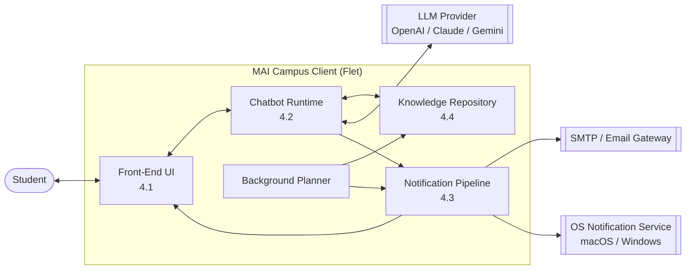
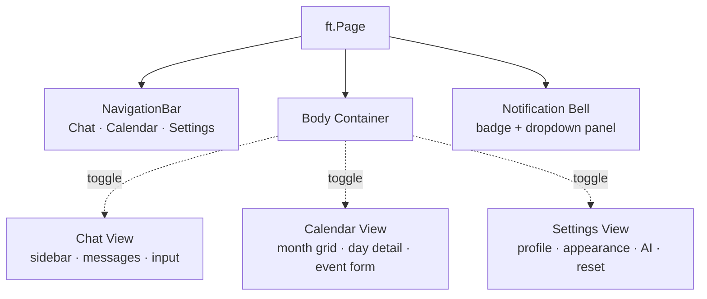
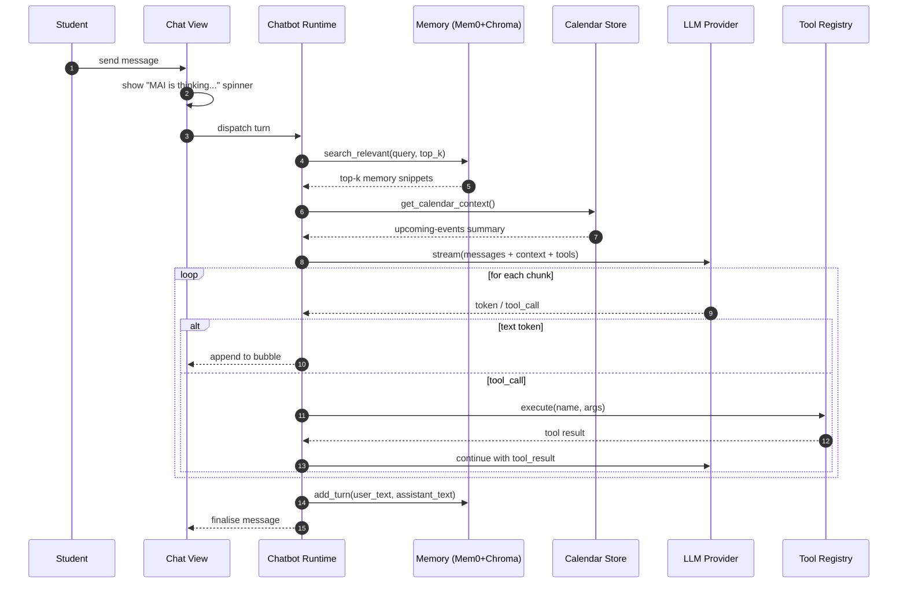
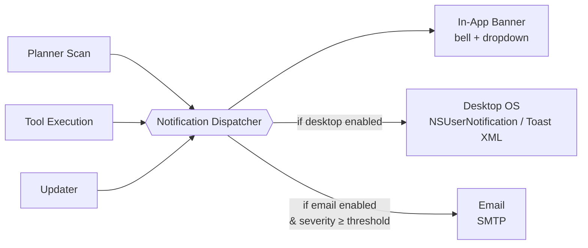
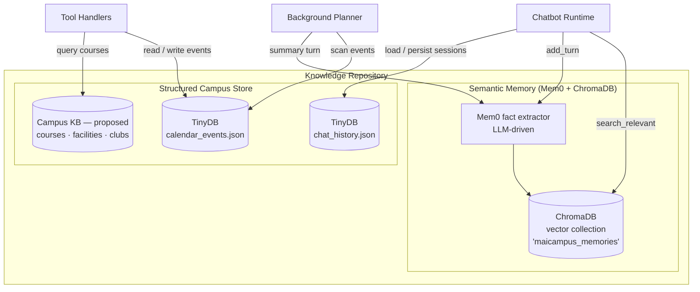

# 4.0 Architecture

MAI Campus is a cross-platform AI student companion built on the Flet framework (Python UI over Flutter). The proposed architecture follows a **modular, event-driven client** pattern in which the application is a single long-running process that composes four cooperating subsystems: the **Front-End UI**, the **Chatbot runtime**, the **Notification pipeline**, and the **Knowledge Repository**. The client is designed to function in an offline-capable, privacy-first posture — all user data is persisted locally (TinyDB for structured records, ChromaDB for vector embeddings) and only leaves the device when the chatbot explicitly calls a configured Large Language Model (LLM) provider.

At the highest level the design separates three concerns:

1. **Presentation** — a reactive UI tree rendered by Flet, driven by user navigation and asynchronous state updates.
2. **Intelligence** — a provider-agnostic chatbot runtime that streams tokens, invokes registered tools, and retrieves relevant memories as context.
3. **Persistence & Knowledge** — two complementary repositories (episodic vector memory and a structured campus knowledge store) that together form the retrieval substrate for the chatbot.

A background **Planner** task periodically scans the structured store and emits alerts through the Notification pipeline, closing the loop between state changes in the knowledge repository and proactive communication with the student.

> **Figma — System Context diagram.** Rounded rectangles for the four subsystems in the light-indigo palette (`#E8EAF6` fill, `#3F51B5` stroke), cylinder shapes for external services (LLM, SMTP, OS), and one actor silhouette for the student. Solid arrows for synchronous calls; dashed arrows for asynchronous notifications.

---

## 4.1 Front-End User Interface (UI)

The UI is implemented with Flet and follows a **stacked-view navigation** pattern: a single `ft.Page` hosts a swappable body container whose content is toggled between three top-level views via a Material 3 `NavigationBar`. This design keeps view state resident in memory, which is a deliberate decision — it allows long-running operations (specifically token streaming from the chatbot) to continue uninterrupted when the student navigates to another tab.

### 4.1.1 View hierarchy

### 4.1.2 Responsibilities per view

| View | Role | Key Controls |
|---|---|---|
| **Chat** | Conversational surface for the student–MAI dialogue | `ListView` of message bubbles, input bar, streaming indicator, history sidebar |
| **Calendar** | Visual management of classes, assignments, deadlines | Month grid, day detail sheet, event creation form |
| **Settings** | First-run bootstrap and runtime configuration | Profile, Appearance (theme), AI provider, Reset |

### 4.1.3 Cross-cutting UI concerns

- **Theming.** A Material 3 indigo colour scheme supports Light, Dark, and System modes; theme state is persisted via `page.shared_preferences` and applied at startup before the first frame is drawn.
- **Bootstrap wizard.** A pluggable step pipeline (`Welcome → Profile → AI Provider → Done`) runs on first launch and is replayed after a reset. Steps are ordered declaratively in a single module, so adding a step requires no changes to the wizard engine.
- **Asynchronous rendering.** Background-thread UI updates are marshalled onto the Flet event loop via `page.run_task()`; controls are never mutated from a worker thread directly.

> **Figma — UI Layout diagram.** Mobile frame (390×844) showing Chat view with notification bell top-right, chat history sidebar on left, message bubbles centre, and input bar bottom. Beside it, Calendar view showing month grid. Use Flet/Material 3 spacing tokens (8/12/16 dp) and surface elevations.

---

## 4.2 Chatbot Architecture

The chatbot is a **provider-agnostic, tool-augmented streaming runtime**. It is designed around three invariants: (1) the UI must receive tokens incrementally as they arrive from the LLM, (2) the runtime must be able to substitute the underlying provider (OpenAI, Anthropic Claude, Google Gemini) without changing calling code, and (3) conversational context must be enriched with retrieved long-term memories before each turn.

### 4.2.1 Turn lifecycle

### 4.2.2 Provider abstraction

A `ProviderConfig` record captures the chosen provider, API key, and optional model override. Each provider adapter exposes a uniform `stream_response(messages, tools) → Iterator[chunk]` contract. Provider-specific request/response formats (Anthropic's `messages` API, OpenAI's `chat.completions`, Gemini's `generate_content`) are normalised at the adapter boundary so that the chatbot runtime handles a single chunk shape.

### 4.2.3 Tool use

Tools are declared as `ToolDefinition` records with a JSON-Schema parameter spec and a handler callable, and registered in a module-level registry. Two tool families are currently shipped:

| Family | Examples | Backing store |
|---|---|---|
| **Calendar tools** | `create_calendar_event`, `list_events`, `update_event_status` | `CalendarEventStore` (TinyDB) |
| **Planner tools** | `analyse_workload`, `draft_study_plan` | Reads calendar + memory |

When the LLM emits a tool call, the runtime executes the handler locally, feeds the result back into the streaming session, and continues generation — enabling multi-step "think → act → observe" loops without leaving the client.

### 4.2.4 Memory-augmented context

Before each turn the runtime performs a semantic search over the user's private memory store (§4.4.1) and concatenates the top-k snippets into the system prompt. After the turn completes, the `(user_text, assistant_text)` pair is forwarded to Mem0 for fact extraction and embedding — creating a closed retrieval-augmented generation (RAG) loop per user.

> **Figma — Chatbot Sequence diagram.** Vertical swimlanes for Student, UI, Runtime, Memory, LLM, Tools. Use teal (`#00897B`) for streaming arrows, amber (`#FB8C00`) for tool-call arrows, grey dashed for persistence writes. Annotate the "MAI is thinking" and "token stream" phases.

---

## 4.3 Notification

The notification pipeline is a **fan-out dispatcher**: a single logical event (e.g. *"Assignment X is overdue"*) is delivered simultaneously across three channels — **in-app banner**, **desktop OS notification**, and **email** — subject to per-channel user preferences. The design separates *event sources* (who generates an alert) from *channels* (how it is delivered) via a shared `NotificationEvent` contract.

### 4.3.1 Event sources

- **Background Planner** — scans the calendar every 5 hours; emits events for overdue items, items due within 3 days, and items due within 7 days.
- **Chatbot Runtime** — emits confirmation events when tool calls mutate user-visible state (e.g. `create_calendar_event` success).
- **Updater** — emits events when a new application version is available.

### 4.3.2 Channel fan-out

### 4.3.3 Channel details

| Channel | Implementation | Trigger criteria |
|---|---|---|
| **In-app banner** | `NotificationCenter` — badge-counted bell icon with a dropdown `ListView` of tiles; each tile optionally deep-links back into the chat with a pre-filled prompt | Always on |
| **Desktop (macOS)** | `UNUserNotificationCenter` via PyObjC bridge; falls back to `osascript display notification` | User opts-in; app is not focused |
| **Desktop (Windows)** | `winrt.Windows.UI.Notifications` Toast XML; falls back to `win10toast` | User opts-in; app is not focused |
| **Email** | SMTP with a templated HTML body; one digest per day plus immediate delivery for *overdue* severity | User opts-in; severity = overdue, or daily-digest window |

### 4.3.4 Delivery guarantees

In-app delivery is synchronous and reliable. Desktop and email channels are best-effort — failures are logged and do not block other channels, and the in-app tile remains the authoritative record of the alert. A per-event idempotency key (`event_id + due_date`) prevents duplicate delivery across channels within a single scan cycle.

> **Figma — Notification Fan-Out diagram.** Three stacked "source" cards on the left (Planner, Tool, Updater), a central dispatcher hexagon, three channel cards on the right (In-App, Desktop, Email). Use red (`#E53935`) for *overdue*, orange (`#FB8C00`) for *due-soon*, teal (`#00897B`) for *informational* severity badges on each card.

---

## 4.4 Knowledge Repository Interaction

The Knowledge Repository is a **dual-store substrate** that combines an *episodic, semantic* layer with a *structured, relational* layer. This separation reflects a deliberate distinction between **what the student has said and learned** (opaque, fuzzy, embedding-searchable) and **what the student has scheduled and is enrolled in** (explicit, queryable, deterministic).

### 4.4.1 Store composition

### 4.4.2 Semantic memory (Mem0 + ChromaDB)

Each conversation turn is passed to the Mem0 pipeline, which uses the active LLM to extract atomic facts (e.g. *"the student's final-year project is due 15 May"*), embeds them using a provider-matched embedder, and writes them to a per-user ChromaDB collection. Retrieval is a top-k cosine-similarity search invoked at the start of every chatbot turn. Embedder selection is provider-coupled — OpenAI → `text-embedding-3-small`, Gemini → `text-embedding-004`, Claude → HuggingFace `all-MiniLM-L6-v2` (since Anthropic offers no first-party embeddings API).

### 4.4.3 Structured campus store

Three TinyDB-backed stores hold structured state:

| Store | Path | Consumers |
|---|---|---|
| `calendar_events.json` | `~/.maicampus/` | Calendar view, planner, calendar tools |
| `chat_history.json` | `~/.maicampus/` | Chat view session list |

Institution-specific facts are **not** held in a local TinyDB file. They live in two **external mock HTTP services** backed by Postgres, so the prototype demonstrates a realistic client → service → database flow:

| Service | Base path | Backed by | Consumers |
|---|---|---|---|
| **University Knowledge Base (UKB)** | `GET /ukb/*` | Postgres (Docker Compose) | `ukb_tools`, Knowledge settings (timetable sync) |
| **Facility Booking API** | `/facility/*` (read + `POST /facility/bookings`) | Postgres (Docker Compose) | `facility_tools`, Facility Booking view |

The UKB is the read-mostly repository of course catalogue entries, lecturers, timetables, enrollments, club directory, and facility metadata (hours, capacity, booking rules). The Facility Booking API additionally owns booking state and enforces conflict prevention (overlapping slots return HTTP 409). Both are implemented in `mock_server/` (FastAPI) and launched with `docker compose up --build`; the app reaches them via `src/campus_api.py` (httpx) at `API_BASE_URL` (default `http://localhost:8000`, overridable with `MAICAMPUS_API_BASE`). The seed (`mock_server/seed.py`) is anchored to the FOL scenario — MECS0033 · Darwin (MEC255043) · Mon 09:00–11:00 · Room N28 · Dr Shafaatunnur — and broadened to a UTM/Malaysian dataset.

Chatbot tools query the UKB to answer questions such as *"do I have class on Monday?"*, *"when does the library close?"*, or *"which clubs focus on technology?"*, and the booking tool/UI chain calls the Facility Booking API to check availability and confirm bookings.

### 4.4.4 Interaction contract

The chatbot is the sole read-intensive consumer of both layers. Writes are scoped by origin:

- **Semantic memory writes** are triggered only by completed chat turns and by the planner's scan summary — both asynchronous and idempotent.
- **Structured writes** flow exclusively through tool handlers, giving the LLM an auditable path to mutate state and allowing the `_on_tool_executed` hook to surface a confirmation notification (§4.3.1).

This one-way write discipline keeps the two stores coherent without requiring a cross-store transaction layer, and makes the system's behaviour fully reconstructible from the tool-call log plus the chat history.

> **Figma — Knowledge Repository diagram.** Two nested group frames inside an outer "Knowledge Repository" frame: a purple-tinted *Semantic Memory* group containing Mem0 and the ChromaDB cylinder, and a blue-tinted *Structured Store* group containing three cylinders (events, chat history, campus KB). Show the chatbot, planner, and tool handlers as external nodes with labelled arrows (`search_relevant`, `add_turn`, `read/write`, `scan`) to indicate direction and frequency.
