

  
User Manual

  <h1>MAI Campus</h1>
  
Your AI companion for classes, deadlines, room bookings, and the rest of campus life.

  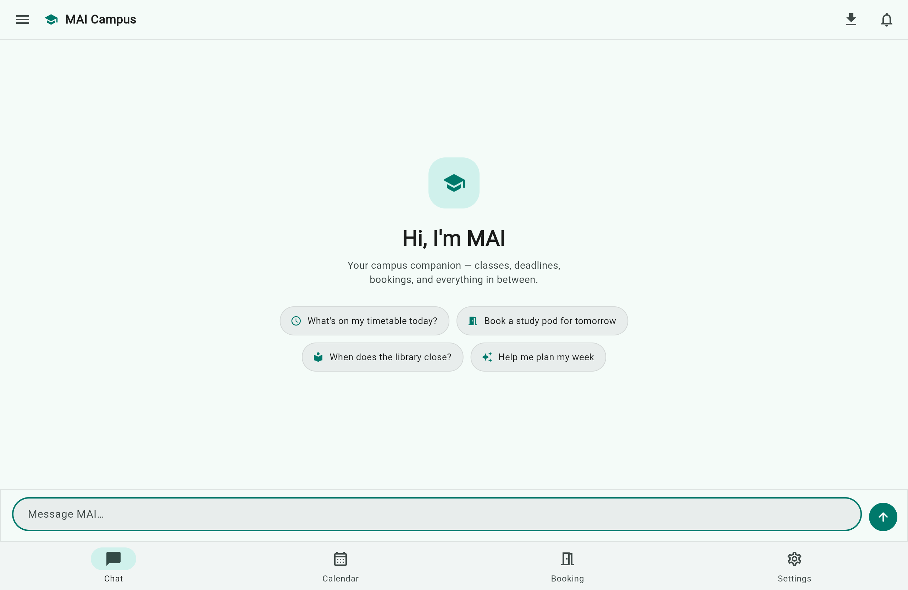
  
Universiti Teknologi Malaysia &middot; Version 0.1

## Welcome to MAI Campus {.no-break}

MAI Campus is a chat-first assistant for your studies. Ask it a question the way you'd ask a
friend who happens to know your timetable, and it answers. Ask it to do something, like book a
room or add a reminder, and it does that too.

Everything you keep in the app stays yours. Your chats, your calendar, and your bookings are
tied to your account, and nobody else can see them.

Here is how the app is laid out. A bar along the bottom switches between four screens:

- **Chat**, where you talk to MAI.
- **Calendar**, where your classes and events live.
- **Booking**, where you reserve rooms, study pods, and courts.
- **Settings**, for your profile, theme, and a few useful tools.

You can move between these screens whenever you like. If MAI is busy answering, it keeps going
in the background while you look around.

The rest of this guide walks through each screen in turn.

## Signing in

MAI Campus is for UTM students, so you sign in with your university Google account. That means
an address ending in `utm.my`, such as `@utm.my` or `@graduate.utm.my`. A personal Gmail
account won't get you in.

<figure>
  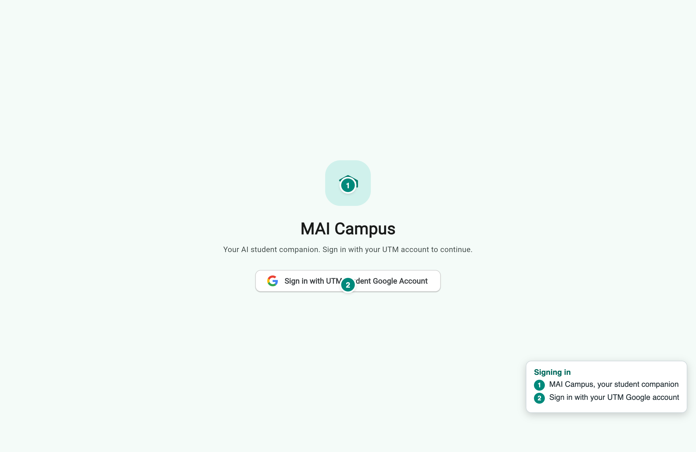
  <figcaption>Figure 1. The sign-in screen.</figcaption>
</figure>

Tap **Sign in with UTM Student Google Account** and pick your university account. The first
time, Google asks you to confirm access. After that you go straight to the Chat screen. You
only sign in once on a device, so the app is ready the next time you open it.

## Chatting with MAI

Chat is where most things happen. When you open the app, MAI says hello and offers a few
suggestions you can tap to get going.

<figure>
  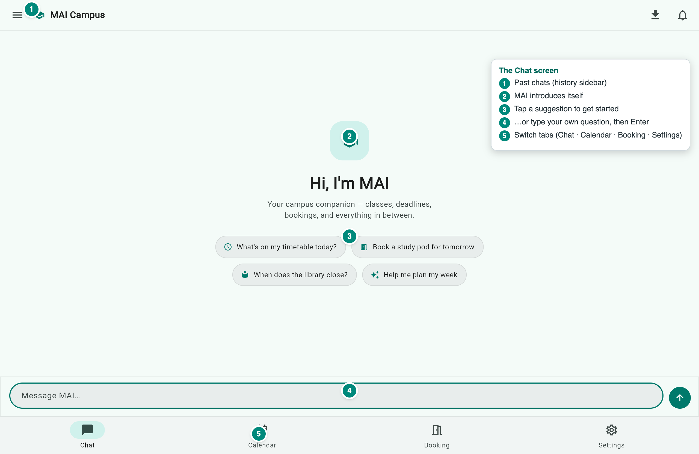
  <figcaption>Figure 2. The chat screen on first open.</figcaption>
</figure>

The menu at the top left holds your past conversations. The chips in the middle are quick
starters, so tap one to send it. To ask your own question, type it in the box at the bottom and
press Enter, or tap the round send button.

### Asking a question

Type whatever you need. If you ask *"What does my class timetable look like this week?"*, MAI
reads your timetable and writes back the whole week, with the room and lecturer for every class.

<figure>
  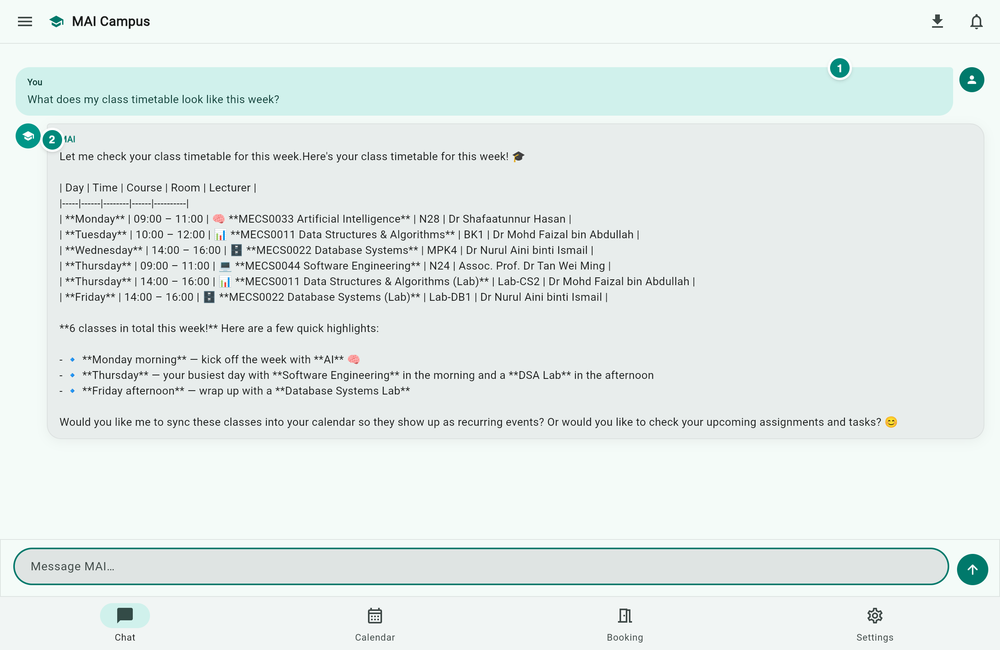
  <figcaption>Figure 3. MAI answering a question about your week.</figcaption>
</figure>

1. Your message shows on the right.
2. MAI's answer arrives on the left and fills in as it is written. Here it has looked up your
   real timetable and set out the week for you.

### More things you can ask

MAI does more than answer questions. Ask it to do something and it gets it done, checking with
you first when it's about to change your calendar or make a booking.

**Set a reminder.** Tell it about anything you want to remember, like a game of football with
friends. It works out the day, makes sure you're free, and adds it once you say yes.

<figure>
  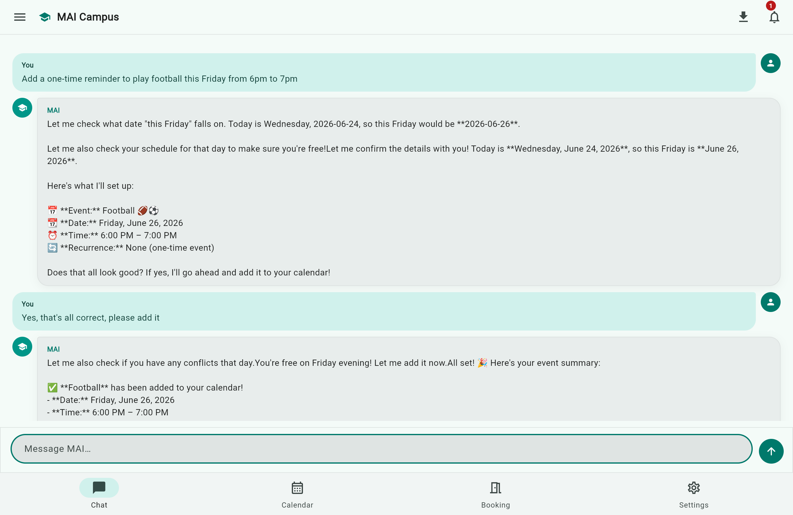
  <figcaption>Setting a reminder, just by asking.</figcaption>
</figure>

**Book a room or a court.** Name a facility and a time. MAI finds it, checks it's free, books
it, and drops it onto your calendar.

<figure>
  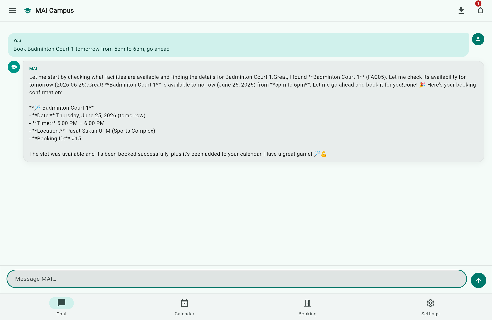
  <figcaption>Booking a badminton court without leaving the chat.</figcaption>
</figure>

**Look something up.** Opening hours, where a class is, which clubs are around. MAI knows the
campus and remembers what you tell it between chats, so you don't have to repeat yourself.

<figure>
  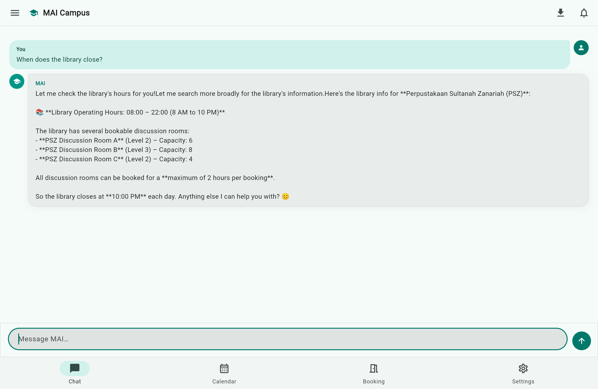
  <figcaption>Asking when the library closes.</figcaption>
</figure>

<strong>You don't have to phrase things a certain way.</strong> Write to MAI like you'd text a
friend. "remind me about football on friday", "is a study room free at 3", and "who teaches
database systems" all work just fine. If MAI is missing a detail, it simply asks.

### Going back to an old chat

Every conversation is saved. Open the menu at the top left to find them.

<figure>
  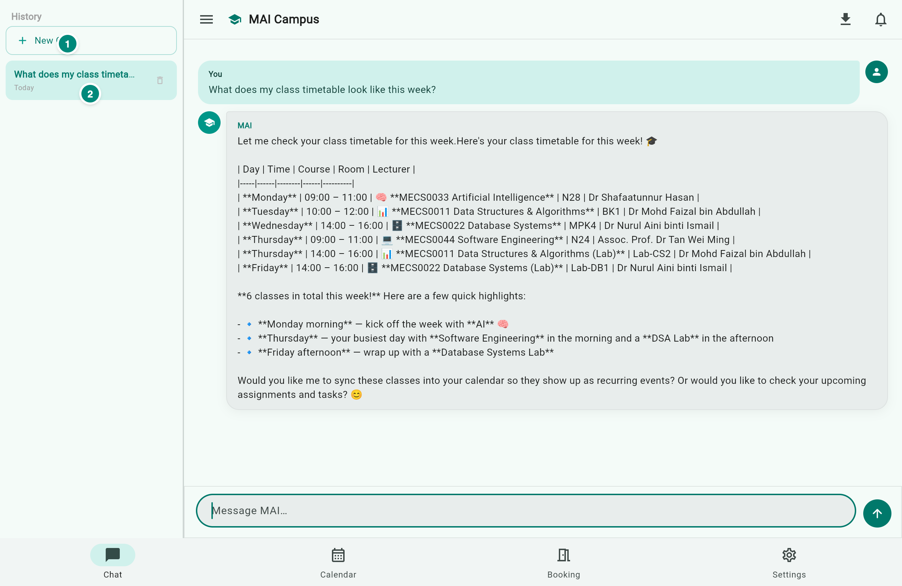
  <figcaption>Figure 4. Your saved conversations.</figcaption>
</figure>

1. **New Chat** starts a fresh conversation.
2. Below it sits the list of everything you've talked about. Tap any item to open it again, or
   swipe it away to delete it.

## Your calendar

The Calendar screen keeps your classes, deadlines, and bookings in one place. The month is on
the left, and the day you've picked is on the right.

<figure>
  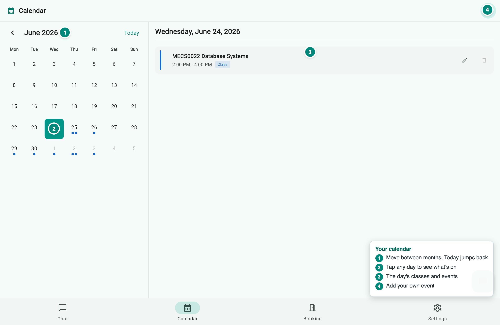
  <figcaption>Figure 5. The calendar, showing the day's classes.</figcaption>
</figure>

A dot under a date means something is on that day. Tap any date to see what. The arrows move
between months, and **Today** jumps you back to the current day. To add something of your own,
use the plus button at the top right.

### Adding an event

The plus button opens a short form.

<figure>
  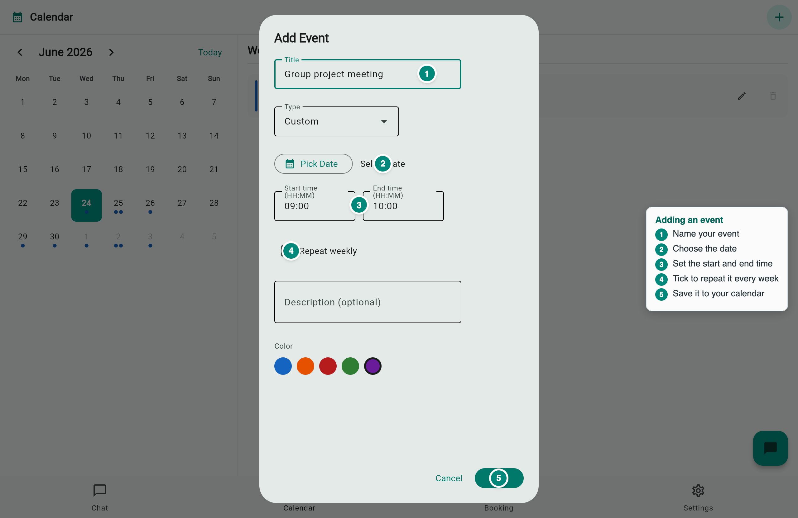
  <figcaption>Figure 6. Adding your own event.</figcaption>
</figure>

Give the event a name, choose its date, and set a start and end time. Tick **Repeat weekly** if
it happens every week, like a club meeting or a gym session. Add a colour if you want it to
stand out, then save. It appears on the day you chose right away.

You can edit or remove anything you added later from the day's list, using the pencil and bin
icons next to it.

## Booking a facility

Need a study pod, a discussion room, or a court? The Booking screen handles it, and it checks
your calendar first so you don't double-book yourself.

<figure>
  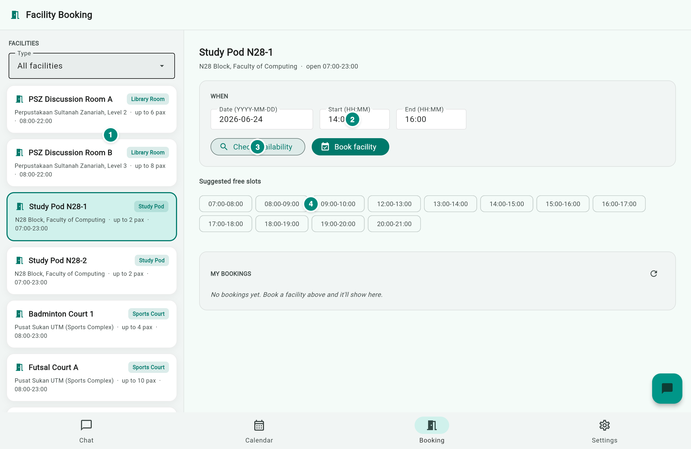
  <figcaption>Figure 7. Finding a facility and a time.</figcaption>
</figure>

1. Pick a facility from the list on the left. You can filter by type at the top.
2. Set the date and the start and end time you want.
3. Tap **Check availability** to see the free hours for that day.
4. Each free slot is a chip. Tap one and it fills in the time for you.

### When something clashes

If the time you choose runs into a class or another booking, MAI stops and tells you, rather
than letting you book over it.

<figure>
  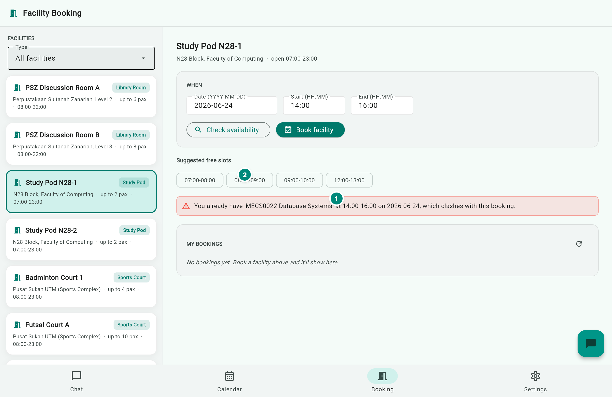
  <figcaption>Figure 8. MAI spotting a clash with your timetable.</figcaption>
</figure>

1. The red note explains what the clash is. Here, the 2pm slot runs into a Database Systems
   class.
2. Pick one of the free slots above instead, then book again.

### Once it's booked

Choose a slot that's clear and tap **Book facility**.

<figure>
  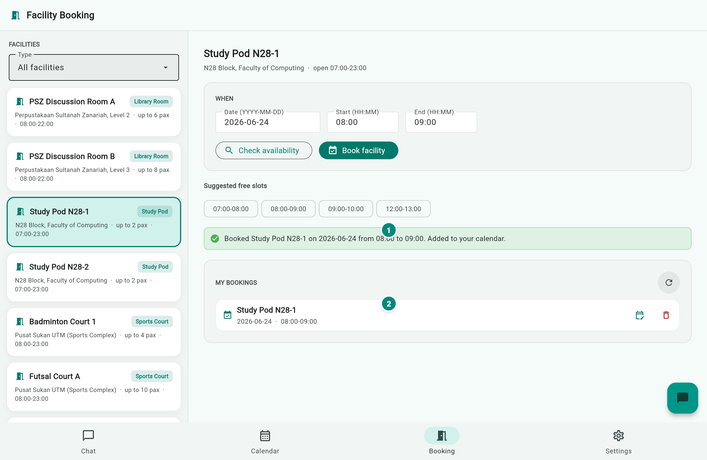
  <figcaption>Figure 9. A confirmed booking.</figcaption>
</figure>

1. A green note confirms it, and the booking is added to your calendar automatically.
2. It also lands in **My Bookings**, where you can reschedule or cancel it whenever you need to.

### Bookings on your calendar

Because a booking is added to your calendar, you'll see it there too, alongside your classes.

<figure>
  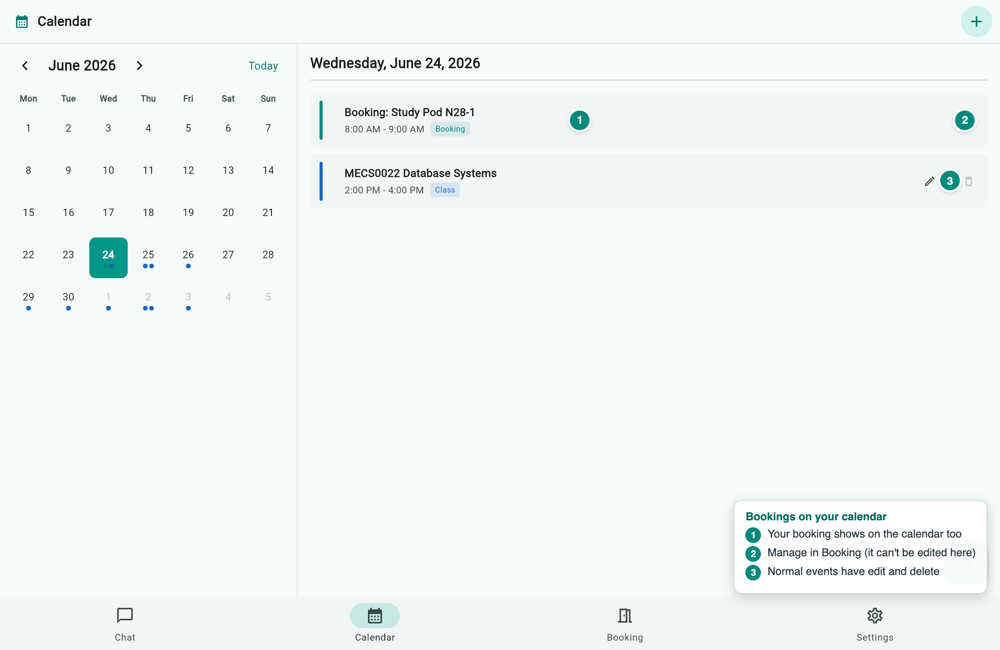
  <figcaption>Figure 10. A booking sitting next to a class on your calendar.</figcaption>
</figure>

A booking carries a small open-in-new icon instead of the usual pencil and bin. That is because
a booking is managed in the Booking screen, not edited in place. Tap the icon and the app takes
you straight there. Your normal events keep their pencil and bin for editing and deleting.

## Settings

Settings is split into a few sections down the left side: Profile, Appearance, Knowledge,
Planner, and Logout.

### Profile

<figure>
  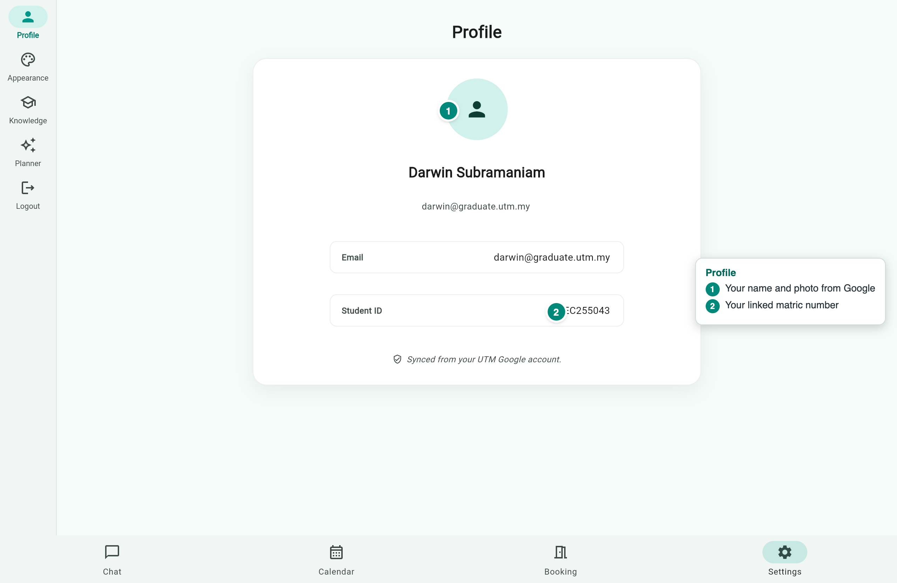
  <figcaption>Figure 11. Your profile.</figcaption>
</figure>

Your name, photo, and email come straight from your UTM Google account, so there's nothing to
fill in. Your matric number is shown too, since the app uses it to find your classes and
bookings.

### Appearance

<figure>
  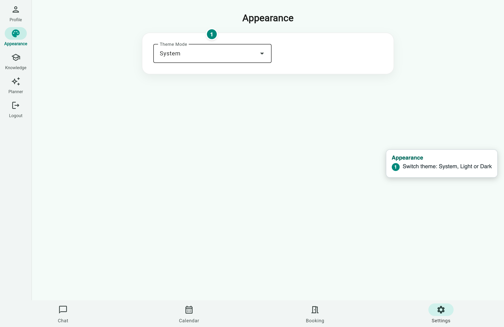
  <figcaption>Figure 12. Choosing a theme.</figcaption>
</figure>

Pick how the app looks. **System** follows your phone or computer, or you can force **Light** or
**Dark**.

### Knowledge

<figure>
  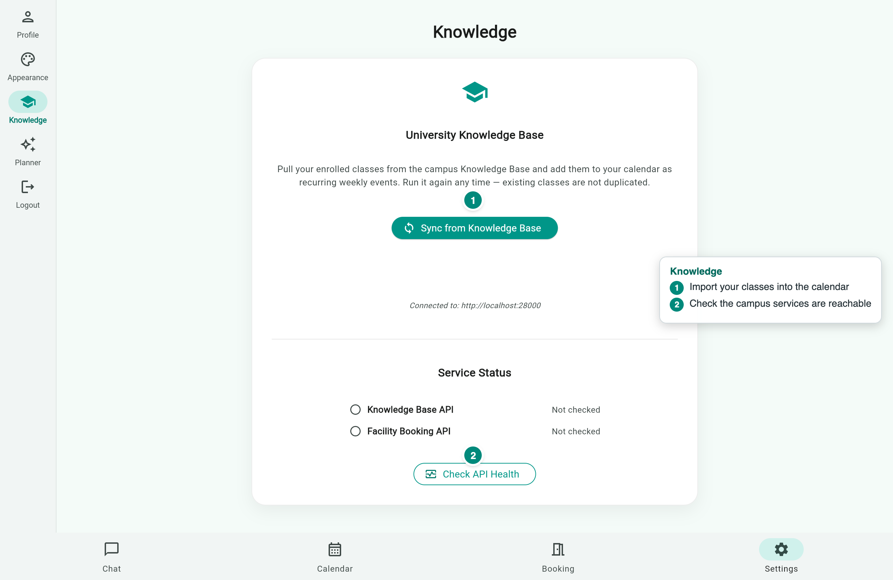
  <figcaption>Figure 13. Syncing your classes.</figcaption>
</figure>

**Sync from Knowledge Base** pulls your enrolled classes from the university and drops them onto
your calendar as weekly events. You can run it again any time, and it won't create duplicates.
Below that, a quick health check tells you whether the campus services are reachable.

### Planner

<figure>
  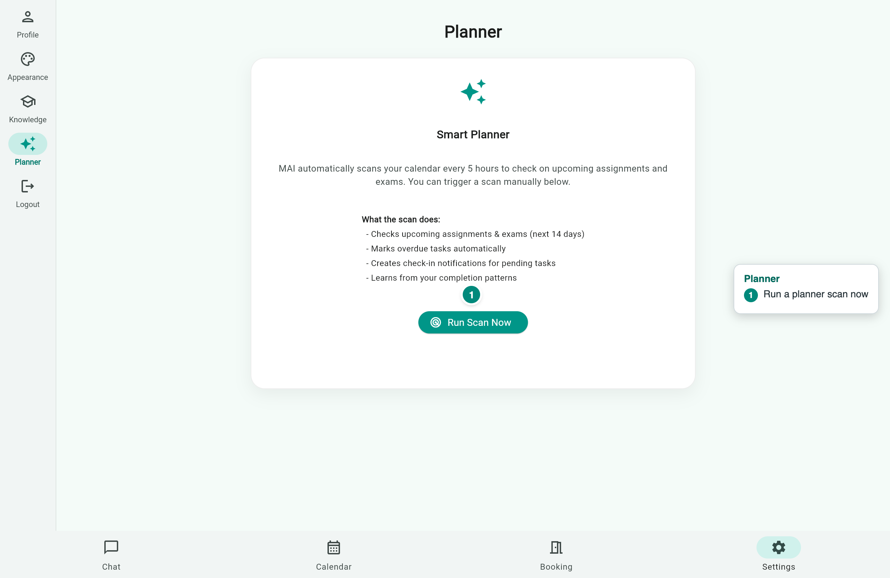
  <figcaption>Figure 14. The Smart Planner.</figcaption>
</figure>

The Smart Planner looks ahead at your assignments and exams and nudges you about what's coming
up. It runs on its own through the day, and you can also start a scan yourself here.

### Logging out

<figure>
  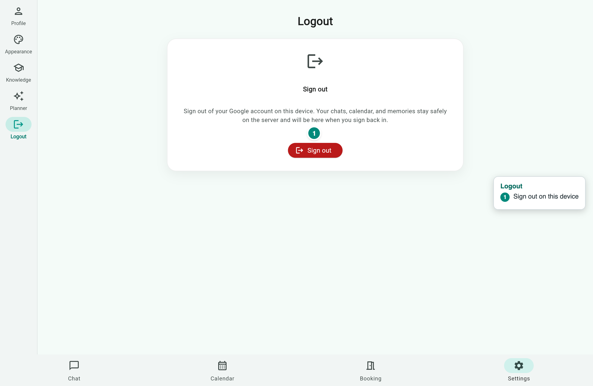
  <figcaption>Figure 15. Signing out.</figcaption>
</figure>

Signing out only signs you out on this device. Your chats, calendar, and bookings stay safe and
are waiting for you the next time you sign back in.

## A few good things to know

There's a daily limit on chat messages so MAI stays quick for everyone. If you hit it, MAI says
so, and your messages reset the next day.

If a screen says a campus service is unavailable, it usually means the connection dropped for a
moment. Try again shortly, or check the campus services from Settings, Knowledge.

You don't have to use the buttons for everything. Most of what's in this guide can be done by
just asking MAI in the chat, including booking a room, adding an event, or syncing your classes.

